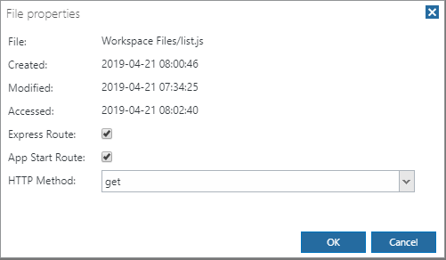

Dynamic EJS List
================
This space illustrates how to use EJS to display information from a database.

What is EJS?
------------
EJS is a simple templating language that lets you generate HTML markup using dynamic data from a Node.js script. For more information, visit http://ejs.co.

Setup
-----
Generally, you will need 2 files to implement EJS:
- A Node.js file to produce the data for the ejs template (list.js)
- An EJS file for the HTML template (list.ejs)

`response.render()` connects the Node.js code to the EJS file. For example:

```
function list(request, response) {  
  var customers = pjs.query("SELECT customerName FROM customers");
  response.render("list.ejs", { customers });
}
```


The Node.js file must be setup as an Express route:



To get to this dialog, right-click the file in the Files tree and select Properties.
